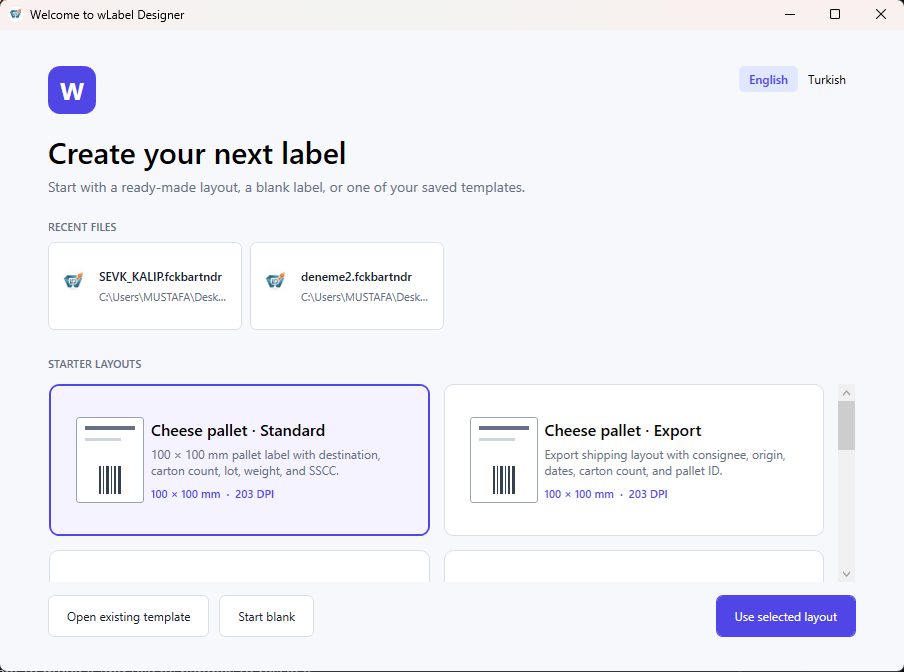
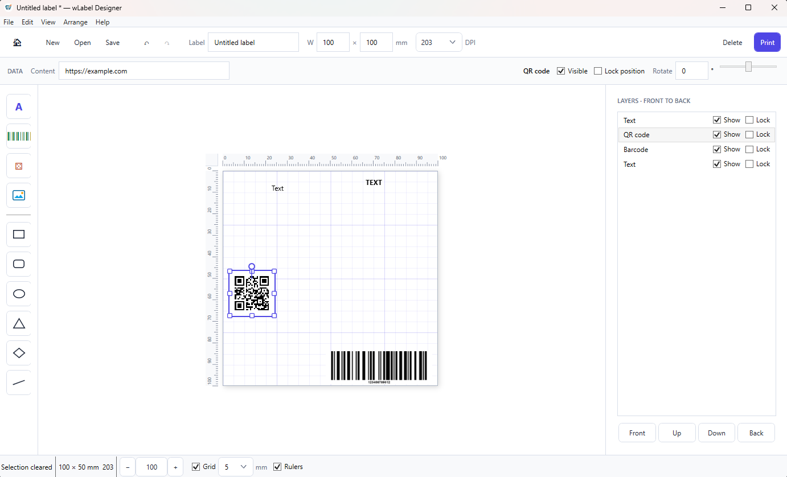

# wLabelDesigner

wLabelDesigner is a lightweight Windows desktop application for designing and printing thermal labels. It targets common 203 and 300 DPI label printers and stores editable templates as JSON-based `.wld` files.

The application is built with .NET 10, WPF, and MVVM.

## Screenshots

### Welcome screen



### Label editor



## Current features

- Welcome screen with recent templates and cheese-pallet shipping, general shipping, product, shelf, and QR contact starter layouts.
- Canvas-based label editor using physical millimetre dimensions.
- Text, Code 128/39, EAN-8/13, UPC-A, ITF-14 barcode, QR code, image, box, rounded-box, line, ellipse, triangle, and diamond elements.
- Drag-to-place element palette.
- Direct element movement and eight-handle resizing.
- Independent line endpoint editing.
- Drag-based and precise numeric element rotation.
- Multiline, in-place text editing.
- Font family, size, color, bold, italic, underline, horizontal/vertical alignment, line spacing, letter spacing, and automatic fitting controls.
- Shape fill, stroke color, opacity, corner radius, stroke thickness, and solid/dashed/dotted stroke controls.
- On-canvas warnings when text overflows its bounds.
- Shift-click multi-selection.
- Group movement, alignment, and distribution.
- Zooming, canvas panning, millimetre rulers, a configurable visual grid, and alignment guides.
- Layer ordering with per-element position locking and visibility controls.
- Undo and redo with coalesced typing and drag operations.
- Cut, copy, paste, duplicate, delete, and keyboard nudging.
- Print preview with printer selection, copy count, margins, and X/Y calibration offsets.
- Saved printer, copy, margin, and calibration settings in each template.
- PNG and PDF export.
- English and Turkish interface languages.
- Context-sensitive formatting and barcode/QR data controls.
- Format-aware barcode validation with check-digit verification before printing or export.
- Per-barcode control over the human-readable value below the bars.
- Per-barcode quiet-zone control in millimetres for reliable scanning.
- Per-QR-code error correction from Low through High.
- Per-QR-code margin control in whole modules.
- Unsaved-change prompts and a recent-files list.
- Opening `.wld` templates by double-clicking them or dropping them onto the application shortcut.
- Built-in F1 user guide.

## Requirements

- Windows 10 or Windows 11, x64.
- [.NET 10 Desktop Runtime](https://dotnet.microsoft.com/download/dotnet/10.0) only when using a framework-dependent build; the self-contained installer includes the runtime.
- .NET 10 SDK to build from source.
- A Windows printer configured for physical printing.

## Build and run

From PowerShell in the repository root:

```powershell
dotnet restore .\wLabelDesigner.csproj; dotnet build .\wLabelDesigner.csproj --configuration Debug --no-restore; dotnet run --project .\wLabelDesigner.csproj --no-build
```

The Debug executable is written to:

```text
bin\Debug\net10.0-windows\wLabelDesigner.exe
```

Close any running copy of the application before rebuilding the normal output path because Windows locks the active executable.

Self-contained publishing and Inno Setup installer commands are documented in [Docs/Build-and-package.md](Docs/Build-and-package.md).

## Basic workflow

1. Choose a recent template or starter layout, create a blank label, or browse for a saved template from the welcome screen.
2. Set the label name, width, height, and printer DPI in the top bar if needed.
3. Drag an element from the left tool rail onto the white label.
4. Drag an element to move it and use its handles to resize it.
5. Double-click text to edit it directly on the label.
6. Select a barcode or QR code to edit its encoded content in the contextual bar above the workspace.
7. Use Shift-click to select multiple elements, then align or distribute them from the contextual top bar.
8. Use the Layers panel to reorder, hide, show, lock, or unlock elements.
9. Save the editable template as a `.wld` file. Use **File → Save As…** (`Ctrl+Shift+S`) to choose a different name or location; subsequent saves use the new file. You can also export the rendered label as PNG or PDF.
10. Press Print to review the label, select a printer, set copies and calibration, and print.

Click empty workspace or press Escape to clear the current selection. Selected elements are temporarily displayed above overlapping elements while editing without changing the saved or printed layer order.

Use the home button in the main toolbar or **File → Welcome screen** to return to the starter layouts. If the current label has unsaved changes, the application asks whether to save it before replacing the document.

## Keyboard shortcuts

| Shortcut | Action |
| --- | --- |
| `Ctrl+N` | New label |
| `Ctrl+O` | Open template |
| `Ctrl+S` | Save template |
| `Ctrl+P` | Open print preview |
| `Ctrl+Z` | Undo |
| `Ctrl+Y` or `Ctrl+Shift+Z` | Redo |
| `Ctrl+C` | Copy selected element |
| `Ctrl+X` | Cut selected element |
| `Ctrl+V` | Paste element |
| `Ctrl+D` | Duplicate selected element |
| `Delete` | Delete selected elements |
| `Escape` | Clear selection or cancel inline text editing |
| `Tab` / `Shift+Tab` | Select next or previous element |
| Arrow keys | Move selection by 0.5 mm |
| `Shift` + arrow keys | Move selection by 5 mm |
| `Shift` + click | Toggle an element in the selection |
| `Ctrl` + mouse wheel | Zoom around the pointer |
| `Ctrl++` / `Ctrl+-` | Zoom in or out |
| `Ctrl+0` | Reset zoom to 100% |
| Middle-button drag | Pan the canvas |
| `Space` + left-button drag | Pan the canvas |
| Double-click text | Begin inline text editing |
| `Enter` | Insert a new line while editing text |
| `Ctrl+Enter` | Commit inline text editing |
| `F1` | Open the user guide |

Keyboard editing commands do not override normal input behavior while a text or combo-box field has focus.

## Template format

Templates use the `.wld` extension and contain human-readable JSON. A template stores:

- Format version and document name.
- Label width, height, and printer DPI.
- Element types, IDs, geometry, content, rotation, visibility, locking, and styling.
- Embedded image data, line direction, and shape stroke settings.
- Preferred printer, default copy count, print margins, and X/Y calibration offsets.

The current template format version is 10. The loader accepts templates with format version 10 or earlier and rejects templates created with a newer, unsupported format.

## NuGet dependencies

- `CommunityToolkit.Mvvm` for MVVM observable properties and commands.
- `BarcodeLib` for linear barcode rendering.
- `QRCoder` for QR-code rendering.
- `CsvHelper` for planned variable-data and batch-printing support.

## Project structure

```text
Converters/   WPF value converters and preview conversion
Docs/         Product specification
Installer/    Inno Setup definition and release automation
Models/       Serializable label document and element models
Properties/   Self-contained publish profile
Services/     Persistence, clipboard, rendering, printing, and history
ViewModels/   Designer and print-preview presentation state
*.xaml        Welcome, designer, help, and print-preview windows
```

Engineering conventions are documented in [AGENTS.md](AGENTS.md). Planned work is tracked in [task.md](task.md).

## Current limitations

- CSV variable fields and batch printing are not implemented yet.
- The grid and alignment guides are visual aids; they do not snap elements into position.
- Autosave and crash recovery are not implemented yet.

## License

This project is licensed under the [GNU General Public License version 3](LICENSE).
